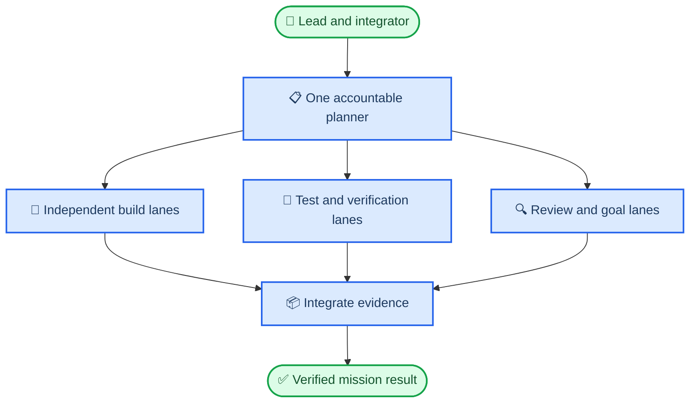

# FairyField OMX development playbook

_The authoritative English operating playbook for V2. Use it after the admission gates in [the pre-OMX migration plan](PRE_MIGRATION_PLAN.md) are satisfied._

---

## 🎯 Product outcome

FairyField V2 is a trustworthy desktop companion, not a catalogue of integrations. A successful product lets a user speak or type a goal, understand what Fairy is doing, approve consequential actions, receive verified results, stop work at any time, and keep control of personal memory.

The V2 core outcome has seven parts:

1. Text tasks can be planned, executed through safe tools, verified, cancelled, and explained.
2. File, web, Git, and coding tasks create real artefacts and prove that they exist.
3. Memory is user-controlled, source-aware, correctable, exportable, and deletable.
4. A coding task runs in an isolated worktree and returns a diff, test evidence, review evidence, and recovery state.
5. Mandarin and English voice interaction is measured, interruptible, and natural enough for daily use.
6. The character reflects speaking and state without obscuring task progress or failures.
7. Every public capability is backed by automated evidence plus the appropriate human acceptance test.

V2 does not begin by pursuing 135 tools, ChatGPT Voice equivalence, autonomous self-modification, or copied Hermes source. Those are neither the product definition nor a substitute for a reliable task loop.

## 👥 OMX capacity and team operating model

### The concurrency contract

For an approved complex mission, FairyField starts with **12 concurrent child agents**, plus one lead/integrator. Twelve is the minimum complex-mission capacity target, not a permanent project-owned upper bound. The actual limit is the supported OMX runtime capacity that the lead has validated against the task graph, available model budget, integration bandwidth, and machine resources.

The team is deliberately elastic. Do not reserve a low fixed number such as four or six when the task graph warrants more coverage, and do not manufacture twelve tasks merely to fill the budget.



| Mission type | Concurrent child-agent budget | Recommended composition |
|---|---:|---|
| Local fix | 0–2 | Executor; optional targeted tester or reviewer |
| Bounded feature | 3–6 | Planner, 1–3 builders, tester, reviewer |
| Cross-module feature | 6–9 | Planner, optional architect, 3–5 builders, test lane, 2 review lanes |
| Complex mission | 10–runtime maximum | Planner, optional architect, enough builders, test lanes, and review lanes to match the approved task graph |

The lead is not included in the child-agent count. It owns scope, integration, user communication, and the final decision. It must not simultaneously edit files owned by active builders.

### How capacity is chosen

Before a team begins, the planner creates a task graph and calculates:

```text
child budget = min(runtime-supported threads, task budget, independent build lanes + test lanes + review lanes + necessary plan/architecture lanes)
```

Increase the budget only when all of the following are true:

- Each lane has a concrete user-visible outcome or evidence objective.
- Concurrent writers have disjoint files or a previously merged shared contract.
- Each writer has a clean worktree and a named integration target.
- Testing and review lanes can evaluate independently rather than repeat the builder's reasoning.
- The lead has enough context budget and time to integrate the outputs.

If a mission needs more lanes than the validated runtime capacity, split it into waves. Complete shared contracts and lowest-risk work first, integrate them, then launch the next wave. If the runtime, task budget, and machine evidence support a higher configured capacity than 12, raise it only through supported OMX configuration and repeat the capacity smoke test. This avoids unresolved parallel edits while allowing large missions to scale beyond twelve agents over time.

### Planning, building, and review are not one-person activities

There is one accountable plan owner, but not only one source of evidence. A complex planning phase can use up to two research or architecture scouts, then the planner produces one merged plan.

Implementation can use many builders. Review must also scale with risk:

| Risk class | Minimum independent quality coverage |
|---|---|
| Local UI or low-risk logic | One tester or reviewer |
| Cross-module behaviour | One tester and two independent reviewers |
| Security, memory migration, credentials, destructive work | One tester, one security/behaviour reviewer, one requirements reviewer, and a final verifier |
| Public release | Full test owner, security reviewer, documentation/reality reviewer, and release verifier |

The current installed OMX guidance still contains a six-child default. Treat that as a migration blocker, not a suggestion to ignore. Configure the supported `[agents] max_threads = 12` initial setting, regenerate or merge OMX project guidance, and run `omx doctor` before starting a 12-child mission. If the runtime cannot honour it, use the largest supported capacity and schedule waves. If it can safely support more, the lead may raise the configured limit after documenting the task budget and capacity smoke evidence.

## 📍 Priorities and functional-first roadmap

| Priority | Meaning | Examples |
|---|---|---|
| P0 | Safety, data integrity, false success, or release blocker | Path escape, secret leak, uncancellable write, false artefact claim, crash |
| P1 | Required for the current user journey | Streaming task loop, file verification, memory control, coding worktree |
| P2 | Quality, observability, or limited expansion | Diagnostics, provider failover, selected integrations |
| P3 | Research or optional expansion | Autonomous growth, plugin marketplace, holographic mode |

P0 always outranks new features. P1 work is ordered by dependency rather than by visual appeal.

```text
M0  Governance, event contracts, and deterministic test foundation
M1  Safe text task loop and artefact verification
M2  Controlled long-term memory
M3  Isolated coding-agent workflow
M4  Bilingual voice, character feedback, and result-presentation policy
M5  Limited integrations that pass the registry gate
M6  Release candidate, packaging, and public release
```

M1 through M3 are the functional core. M4 is intentionally later: voice quality and how Fairy speaks task results deserve focused work after it can reliably complete the underlying task. Basic voice-device preflight and recorded-audio tests may run earlier, but TTS polishing does not delay core task correctness.

## 📋 Standard task lifecycle

Every task uses the same evidence loop. No phase label, model statement, or test total substitutes for it.

1. **Intake:** Rewrite the request as a user-observable outcome.
2. **Reality check:** Read relevant code, tests, `STATUS.md`, and applicable Hermes or MemPalace patterns.
3. **Plan:** Define scope, non-goals, dependencies, risks, agent budget, worktree ownership, and acceptance criteria.
4. **Test design:** Add or update deterministic regression, contract, integration, and benchmark cases before implementation.
5. **Build:** Implement the smallest complete behaviour in a bounded worktree.
6. **Machine verification:** Run targeted checks, affected-system checks, and the required headless suite.
7. **Independent review:** Review safety, behaviour, test adequacy, and requirement coverage separately from implementation.
8. **Goal verification:** Produce a requirement-to-evidence matrix with only `pass`, `fail`, or `unverified` entries.
9. **Integration:** Lead merges verified work, re-runs the integration matrix, and records actual outcomes.
10. **Human acceptance:** Run only the remaining physical, subjective, or visual checks after automation passes.

Task states are `ready`, `active`, `blocked`, `review`, `verified`, and `integrated`. Terminal alternatives are `failed` and `cancelled`. A task may not move from `review` to `integrated` without independent evidence.

### Task specification

```yaml
id: M1-P0-desktop-markdown-artifact
objective: Create and verify a Markdown file from a researched answer.
milestone: M1
priority: P0
lead: lead-integrator
agent_budget: 5
lanes:
  - planner: task graph and acceptance
  - tools-builder: path and artefact behaviour
  - agent-builder: loop and finalisation behaviour
  - test-engineer: deterministic integration and benchmark case
  - reviewer: safety and requirement evidence
scope_in:
  - specified modules and contracts
scope_out:
  - third-party integrations and voice polish
dependencies:
  - ARC-001
security_class: local-write
acceptance:
  - criterion: user-approved Desktop path is contained and writable
    evidence: integration test and read-back artefact assertion
  - criterion: final response identifies the verified file and any failure
    evidence: AgentBench event/result assertion
rollback: remove the worktree branch; preserve failed evidence
```

One task normally changes one user behaviour or one shared contract. If it cannot produce a reviewable diff in two working days, split it. Capture the base commit, working-tree status, relevant file hashes, and diff before work begins; a list of already-dirty filenames is not sufficient change detection.

## 🧪 Automated capability evaluation

### Test before manual UI work

The system must test all practical non-visual behaviour itself before asking the user to open the interface. This means commands, contracts, simulated providers, filesystem fixtures, mock browser responses, and deterministic audio fixtures—not merely unit tests and not a model's own summary.

| Test layer | What it proves | Default execution |
|---|---|---|
| Unit | Parsing, Unicode boundaries, path policy, state transitions | Every affected task |
| Contract | Rust/TypeScript events and provider/tool/MCP schemas | Every contract change |
| Integration | Agent with scripted provider plus real SQLite/filesystem fixtures | Every affected subsystem |
| Headless UI | Chat, approval, progress, cancel, error, and result states | Every user-flow change |
| AgentBench | Multi-step task outcomes and safety decisions | Every integration branch |
| Optional live smoke | Real provider or external service behaviour | Explicit opt-in only |
| Human acceptance | Hardware, naturalness, avatar feel, clean install | After all machine gates pass |

The test owner must first identify every registered production capability and classify it as `Deterministic`, `MockPlusLive`, `ManualOnly`, or `Experimental`. A `ManualOnly` capability cannot become `Verified`; it needs a machine-testable core plus a manual acceptance note.

### Hermes-inspired AgentBench

FairyField uses Hermes as a reference for capability classes, especially tool observation, tool-error recovery, file containment, command guards, browser/web safety, cancellation, coding evidence, memory boundaries, and process lifecycle. It does not copy Hermes runtime code or claim feature parity.

The benchmark layout should be versioned and deterministic:

```text
tests/agent_bench/
  manifest.yaml
  providers/scripted/
  fixtures/web/
  fixtures/files/
  fixtures/audio/
  cases/
  reports/
```

Every case declares:

```yaml
id: WEB-UTF8-001
family: web-and-content-safety
initial_state: empty-session
provider_script: search-then-write-markdown
fixtures: [unicode-search-results, hostile-web-page]
expected_events: [plan, tool-start, tool-result, file-verified, final]
expected_artifacts: [sandbox/Desktop/weather.md]
expected_safety: no-byte-index-panic; untrusted-page-not-promoted-to-instruction
verdict: pass | fail
```

`TST-001` makes this benchmark executable: it creates `npm run test:agent-bench`, validates the manifest, runs the deterministic fixtures, and emits a machine-readable CI artefact. Case IDs follow `<FAMILY>-<NNN>`; Assurance/Release owns the runner and manifest, while each module owner owns its fixtures and cases. The manifest must map every advertised `capability_id` to one or more deterministic case IDs and, when needed, a live smoke case.

The functional-core suite starts with at least 24 deterministic cases and grows whenever a defect reaches a human test. Twenty-four is the coverage floor, not an acceptable failure rate: every required deterministic P0/P1 case must pass. A skipped live smoke never upgrades a capability to `Verified`. Cases must cover:

| Family | Required examples |
|---|---|
| Conversation and planning | Direct answer, task plan, budget pressure, truthful finalisation |
| Tool observation | Search result followed by file write/read, same-batch sequential actions, repair after tool error |
| Web safety | Chinese, English, Japanese, timeout, empty result, hostile content, encoding boundary |
| File artefacts | Approved Desktop path, containment, atomic write, overwrite decision, read-back verification |
| Permission and Git | Denied command, path traversal, destructive Git request, secret redaction |
| Cancellation and recovery | Cancel slow provider/tool, no post-cancel side effect, retry with a changed hypothesis |
| Memory | Save, restart, retrieval, correction, deletion, prompt isolation |
| Coding | Scoped worktree, failing-test feedback, diff collection, reviewer evidence, cancellation |
| Voice core | Recorded Mandarin/English clips, VAD state, partial/final ASR, TTS text cleaning |

Network, user files, personal accounts, and the real Desktop are replaced with controlled fixtures. A live test must be explicitly enabled, use a sandbox or test account, and prove no destructive side effect occurred.

### Test gates and escape policy

| Gate | When | Required result |
|---|---|---|
| Fast gate | Before review | Targeted regression, formatter, type/compiler checks |
| Affected-system gate | Before merge | Related frontend, Rust, optional feature, contract, and AgentBench tests |
| Full headless gate | Integration branch and nightly | Entire deterministic test matrix |
| Live smoke gate | External tool/provider release candidate | Opt-in, isolated environment, evidence saved |
| Human gate | Final acceptance | Device, naturalness, visual and install results recorded |

When a test fails, retry at most twice with a changed, written hypothesis. A third recurrence triggers diagnosis and replanning. Do not rerun the same command until it passes by chance.

An escaped defect creates three mandatory outputs: a minimal regression test, a root-cause note, and a new or strengthened benchmark case. A human report is therefore converted into automation instead of becoming an anecdote.

## ⚙️ Functional-core milestones

### M0: governance and test foundation

M0 establishes the conditions for fast, safe parallel work.

| ID | Priority | Outcome | Acceptance evidence |
|---|---|---|---|
| GOV-001 | P0 | Recoverable pre-V2 checkpoint | Clean-clone restoration report |
| GOV-002 | P0 | One English documentation authority | No conflicting mandatory rules |
| GOV-003 | P0 | OMX capacity set to 12 child agents | Supported config, regenerated guidance, and `omx doctor` evidence |
| ARC-001 | P0 | Shared request/tool/voice event schema | Rust and TypeScript contract tests |
| ARC-002 | P0 | Error taxonomy and cancellation lifecycle | No hidden error or post-cancel side effect |
| TST-001 | P0 | AgentBench manifest, fixtures, and runner | First deterministic cases pass in CI |
| CI-001 | P0 | Full default and Sherpa feature matrix | Clean checkout is green |
| SEC-001 | P0 | Secret, path, and generated-state boundary | Scan and containment tests pass |

### M1: safe text task loop

The user can request research followed by a Markdown artefact. Fairy plans, searches, writes only with permission, reads the file back, and reports the verified path. It does not claim success merely because a tool returned text.

| ID | Priority | Outcome | Acceptance evidence |
|---|---|---|---|
| LLM-001 | P0 | Streaming provider trait with cancellation and mocks | Provider contract suite |
| AGT-001 | P0 | Explicit task state machine and budget | No infinite loop; truthful exhaustion result |
| AGT-002 | P0 | Tool rounds, repair limits, and finalisation | Duplicate/error/budget benchmark cases |
| TOOL-001 | P0 | Registry admits only complete tools | Scaffold cannot be user-visible |
| TOOL-002 | P0 | Schema validation and type repair | Malformed arguments are bounded and observable |
| TOOL-003 | P0 | Shared permission and approval state | UI approval affects the actual executor |
| WEB-001 | P1 | Unicode-safe, cancellable search/fetch | Encoding, timeout, hostile-content cases |
| FILE-001 | P0 | Contained path and atomic artefact write | Desktop fixture and read-back cases |
| ART-001 | P0 | Artefact verifier | Final result references a real verified file |
| E2E-001 | P0 | Research-to-Markdown end-to-end script | Ten consecutive deterministic passes |

### M2: controlled long-term memory

Memory work begins only after the text loop is trustworthy. The goal is not maximum recall; it is correct, inspectable, user-controlled recall.

| ID | Priority | Outcome | Acceptance evidence |
|---|---|---|---|
| MEM-001 | P0 | Versioned schema and migration | Migration plus rollback test |
| MEM-002 | P1 | Verbatim source, dedupe, temporal invalidation | Original text and changed-fact cases |
| MEM-003 | P1 | Multilingual FTS baseline | Fixed-corpus precision/recall report |
| MEM-004 | P0 | Provenance and prompt isolation | Untrusted memory cannot become instructions |
| MEM-005 | P1 | View, correct, export, and delete | UI/database consistency integration test |
| E2E-002 | P0 | Restart memory journey | Save, restart, retrieve, correct, delete |

### M3: coding-agent workflow

Coding ability is a product workflow, not a subprocess launch. Fairy supplies worktree isolation, bounded permissions, progress, cancellation, diff evidence, testing, review, and recovery around a coding runtime such as Codex or OpenCode.

| ID | Priority | Outcome | Acceptance evidence |
|---|---|---|---|
| CODE-001 | P0 | Coding runtime contract | Adapters do not leak into primary agent logic |
| CODE-002 | P0 | Worktree lifecycle and user-change protection | No writes outside task workspace |
| CODE-003 | P0 | Structured progress, timeout, cancellation | No orphan process after cancel or timeout |
| CODE-004 | P0 | Diff, test, and artefact collection | CLI exit code alone cannot prove completion |
| CODE-005 | P0 | Command approval and safety policy | Destructive commands require approval or fail |
| CODE-006 | P1 | Independent review and requirement verification | Requirement-to-evidence matrix is complete |
| E2E-003 | P0 | Real small-repository repair | Reproduce, patch, test, review, and cancel journey |

## 💬 M4: voice and task-result presentation

Voice and presentation work begins when M1–M3 P0/P1 functionality is stable. It has two related tracks: the bilingual voice pipeline and the policy for how Fairy communicates results.

### Voice pipeline

ADR-005 must benchmark candidate ASR/TTS routes before choosing one. Do not keep layering patches on system `say`, Kokoro, Matcha, or any other engine because it is already present.

The benchmark measures recorded Mandarin, English, mixed-language, and basic Japanese fixtures; partial transcript latency; final transcript accuracy; TTS first-audio latency; real-time factor; interruption; CPU/memory; model size; and licence compatibility. It also tests Markdown, code, URLs, paths, emoji, and unusual symbols so the spoken text does not become unnatural or misleading.

ADR-005 must ratify the following provisional M4 exit gates on the target machine. They may be tightened or replaced only by a recorded ADR with an equivalent or stronger user outcome:

| Measure | Provisional M4 gate |
|---|---|
| Mandarin fixture accuracy | >= 90% character accuracy on the approved clean corpus |
| English fixture accuracy | >= 92% word accuracy on the approved clean corpus |
| Mixed-language fixture accuracy | >= 85% token accuracy on the approved corpus |
| Partial transcript latency | P95 <= 1.0 s from supported speech onset |
| Final transcript latency | P95 <= 2.0 s after end of utterance |
| TTS time to first audio | P95 <= 1.5 s after a validated speech segment is ready |
| Barge-in | P95 <= 350 ms to stop audible playback and pending generation |
| Text normalisation | 100% of approved fixtures avoid verbatim Markdown, code, URL, and symbol speech |
| Failure behaviour | No silent system-voice fallback; missing model/device/provider is explicit and recoverable |

| ID | Priority | Outcome | Acceptance evidence |
|---|---|---|---|
| VOI-001 | P0 | Device enumeration, permission, and failure states | No crash on denied or removed device |
| VOI-002 | P1 | VAD state model | Controlled silence/noise/speech fixtures |
| VOI-003 | P0 | Streaming bilingual ASR | Mandarin/English partial and final transcript cases |
| VOI-004 | P0 | Text normalisation and language segmentation | No Markdown, code, or strange symbols spoken verbatim |
| VOI-005 | P1 | Streaming TTS queue | Measured first audio and no avoidable sentence gap |
| VOI-006 | P0 | Barge-in interruption | Audio and generation stop within agreed budget |
| VRM-001 | P1 | RMS/PCM lip sync | Mouth moves while speech is audible and resets afterward |
| VRM-002 | P2 | State-driven expression and idle animation | Smooth, cancellable motion with no drift |
| UX-001 | P1 | Structured task-result view model | Five result-state UI contract tests |
| UX-002 | P1 | Spoken result composer | Five result-state TTS normalisation tests |
| E2E-004 | P0 | Bilingual conversation endurance | Recorded metrics plus human device acceptance |

Automated audio tests use fixture recordings and synthetic expected outputs. Human acceptance remains required for microphone placement, Chinese/English naturalness, perceived latency, and the character's emotional feel.

### Result transparency and black-box boundary

ADR-008 decides the user experience after the functional core is reliable. The default must be transparent enough to build trust and quiet enough to feel like a companion:

| Show to the user | Keep internal |
|---|---|
| Goal interpretation and concise plan | Raw chain-of-thought and hidden model reasoning |
| Permission request and risk | Secrets, credentials, private paths, and redacted data |
| High-level progress and current tool/action | Verbose tool payloads and internal debug traces |
| Verified artefact, result, limitation, or failure | Irrelevant retries and model-token details |
| Clear next action or choice | Unfiltered stack traces unless diagnostic mode is enabled |

Screen output may offer a compact evidence trail for users who want it. Spoken output should say what changed, where the result is, what was verified, and what needs the user's decision. It should not read code blocks, Markdown syntax, URLs, tool logs, or every internal step aloud.

The five required result-state contracts are:

| State | Screen result | Spoken result | Automated assertion |
|---|---|---|---|
| Success | Verified artefact and concise outcome | What changed and where it is | Artefact and summary event agree |
| Partial success | Completed parts plus explicit limitation | What is ready and what could not finish | No false completed claim |
| Approval needed | Risk, scope, and clear choice | A short request for permission | No side effect before approval |
| Cancelled | Stopped state and any preserved artefact | Work stopped; state whether anything changed | No post-cancel event or write |
| Failure | Failed step, safe reason, and next action | What failed and a useful next choice | No raw error leak or success wording |

## 🔗 Integration, Git, and documentation discipline

### Tool registration gate

M5 adds one integration at a time. A tool cannot be listed as usable until it has a stable ID, schema, permission scope, timeout, cancellation path, rate policy, secret handling, deterministic mock, opt-in live smoke, post-action verification, user documentation, and revocation or uninstall path.

The initial order is Git/GitHub, browser or controlled desktop automation, calendar/reminders, Discord, and then work integrations. Community plugins remain experimental until the same gate is met.

### Worktree and branch rules

```text
omx/m1/WEB-001-unicode-search
omx/m3/CODE-002-worktree-lifecycle
fix/p0/path-containment
```

- One concurrent write task gets one clean temporary worktree.
- Shared contracts, manifests, version files, and release files are owned by the lead/integrator.
- Parallel tasks require disjoint write scopes or an already-merged interface contract.
- Preserve failed worktrees for diagnosis; remove them after integration or explicit cancellation.
- Never reset, overwrite, or clean unrelated user changes.
- Never run a Tauri release build in ordinary task verification.

### Documentation updates

Update `docs/v2/STATUS.md` after each integration with current commit, verified/beta/experimental capability state, tests run, known issues, blockers, and ready tasks. Update the roadmap only when milestone scope changes. Update README and user guides after a capability passes its registration and acceptance gates. Update CHANGELOG only for a released user-visible change.

## ✅ Release gates and session checklist

### Release candidate gate

- [ ] M0–M4 P0/P1 tasks are integrated with requirement-level evidence
- [ ] AgentBench and full headless matrix pass from a clean checkout
- [ ] No P0/P1 defect is open; P2 limitations are disclosed and owned
- [ ] Text, memory, coding, and bilingual voice user journeys pass their deterministic and human gates
- [ ] Secret, licence, path, data export/delete, and upgrade checks pass
- [ ] README describes only verified or explicitly labelled beta behaviour
- [ ] Packaging, signing, notarisation, clean install, upgrade, and uninstall have evidence
- [ ] Only then run the explicit Tauri release build on the tagged release candidate

### Every OMX session

1. Confirm branch, worktree, `STATUS.md`, and the current task's evidence contract.
2. Run `omx doctor` when using OMX team orchestration; confirm actual runtime capacity and task budget before allocating more than six child agents.
3. Choose the highest-priority ready task whose dependencies are satisfied.
4. Decide direct execution, `$ralplan`, `$team`, or `$ralph` from the task graph.
5. Allocate the smallest useful agent budget, starting at 12 for a justified complex mission and scaling only to the validated runtime-supported capacity.
6. Add or update automated tests before implementation, then run the appropriate gates.
7. Use independent review and requirement verification; do not let builders approve their own completion.
8. Integrate, record evidence, update `STATUS.md`, and leave failed work visible rather than silently discarded.

A task is done only when the user-observable outcome works, expected failures are defined, automated evidence passes, independent review has no unresolved P0/P1 finding, a verifier has completed the requirement matrix, and the status document reflects reality.
